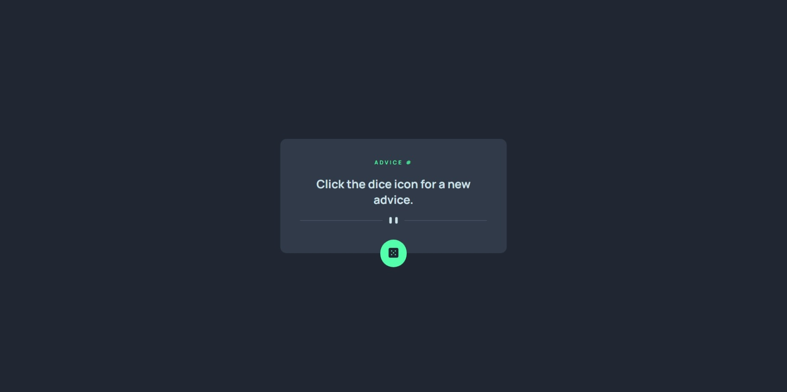

# Frontend Mentor - Advice generator app solution

This is a solution to the [Advice generator app challenge on Frontend Mentor](https://www.frontendmentor.io/challenges/advice-generator-app-QdUG-13db).

## Table of contents

- [Overview](#overview)
  - [The challenge](#the-challenge)
  - [Screenshot](#screenshot)
  - [Links](#links)
- [Author](#author)

## Overview

### The challenge

Users should be able to:

- View the optimal layout for the app depending on their device's screen size
- See hover states for all interactive elements on the page
- Generate a new piece of advice by clicking the dice icon

### Screenshot

### Links

- [Solution URL](https://www.frontendmentor.io/solutions/advice-generator-app-0UCzOquH_L)
- [Live Site URL](https://badukucuk.github.io/frontend-mentor/advice-generator-app/)

## Author

- X - [@badukucuk](https://x.com/badukucuk)
- Frontend Mentor - [@badukucuk](https://www.frontendmentor.io/profile/badukucuk)
