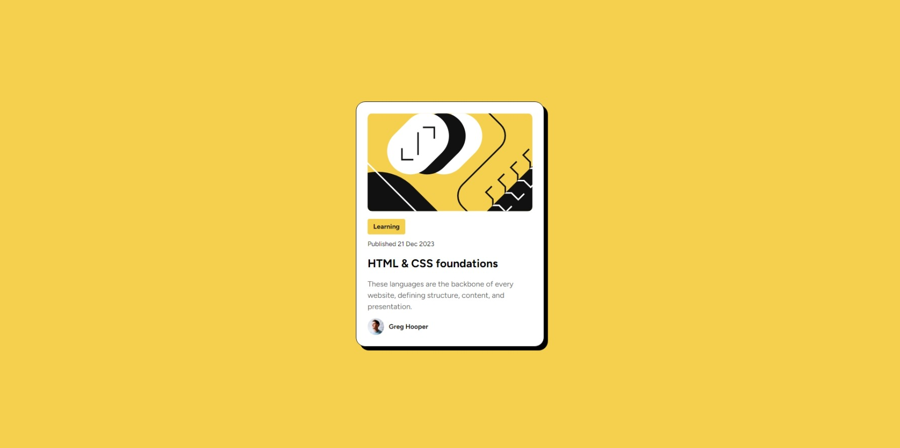

# Frontend Mentor - Blog preview card solution

This is a solution to the [Blog preview card challenge on Frontend Mentor](https://www.frontendmentor.io/challenges/blog-preview-card-ckPaj01IcS).

## Table of contents

- [Overview](#overview)
  - [The challenge](#the-challenge)
  - [Screenshot](#screenshot)
  - [Links](#links)
- [Author](#author)

## Overview

### The challenge

Users should be able to:

- See hover and focus states for all interactive elements on the page

### Screenshot

### Links

- [Solution URL](https://www.frontendmentor.io/solutions/blog-preview-card-LIqca_-MVk)
- [Live Site URL](https://badukucuk.github.io/frontend-mentor/blog-preview-card/)

## Author

- X - [@badukucuk](https://x.com/badukucuk)
- Frontend Mentor - [@badukucuk](https://www.frontendmentor.io/profile/badukucuk)
