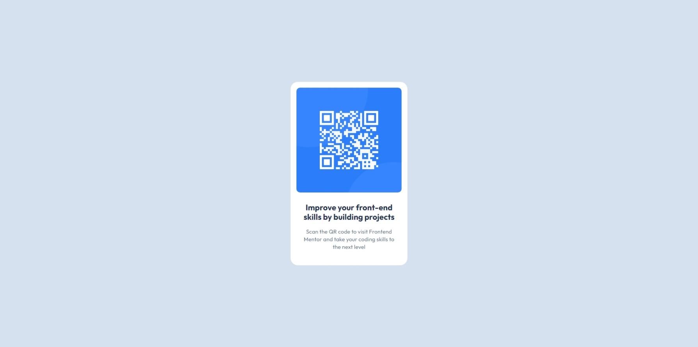

# Frontend Mentor - QR code component solution

This is a solution to the [QR code component challenge on Frontend Mentor](https://www.frontendmentor.io/challenges/qr-code-component-iux_sIO_H).

## Table of contents

- [Overview](#overview)
  - [Screenshot](#screenshot)
  - [Links](#links)
- [Author](#author)

## Overview

### Screenshot

### Links

- [Solution URL](https://www.frontendmentor.io/solutions/qr-code-component-QNi5ec8Cwn)
- [Live Site URL](https://badukucuk.github.io/frontend-mentor/qr-code-component/)

## Author

- X - [@badukucuk](https://x.com/badukucuk)
- Frontend Mentor - [@badukucuk](https://www.frontendmentor.io/profile/badukucuk)
